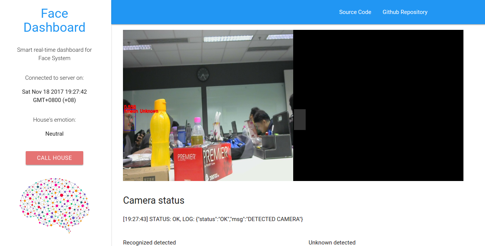
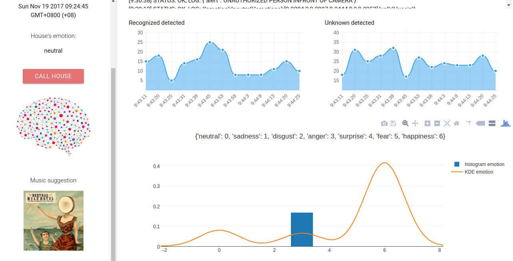

# FACE2017, SHIAT Team
Face Hackathon 2017 organized by UM

# Smart House System for non-normal Joe
1. It able to detect faces live using any camera.
2. It able to detect recognized faces live from segmentation.
3. It able to detect emotion to suggest in-house music.
4. It able to study emotion distribution for the house.
5. It able to plot live graph from live camera data.

This website basically tell your house emotion distribution, send notification if unauthorized person coming in, plot data density and so much more.

## Technologies used
```text
1- RSA Encryption
2- Deep learning, Multi-task convolutional Neural Network
3- Web Socket
4- Plotly
5- Structured database, mySQL
6- Spotify API
```

## How we trained our face recognition locally?
```text
1- we downloaded random face images in the internet, tagged it as 'UNKNOWN'.
2- capture my face, tagged it as 'HUSEIN'.
3- augmentation every images for 5 times, random rotation, random brightness, random flip.
4- change every images into gray and calculate component analysis.
5- we use extreme boosting algorithm trained on 100 components.
6- trained on 3 different extreme boosting with different hyperparameters, results will stacked using harmonic mean.
```

## Languages used
```text
1- python
2- Javascript
```

## How is the basic flow for the system?
```text
1- generate private and public RSA keys.
2- MTCNN will give output {segmentation, results}.
3- hash the output faces.
4- encrypt the data using public key, and send it to server through websocket.
5- decrpyt the data using private key from the server.
6- save to mysql for historical data study.
7- broadcast to front-end.
8- send emotion keywords to Spotify API to get music suggestion.
```

## how the system detected emotion?
```text
1- every 5 seconds, a thread will spawn to check density data [non authorized, authorized].
2- if authorized detected more than 10 times, it will do POST requests to API provided.
3- emotion returned will save into mySQL.
```

## How it done the calculation?
```text
1- collect emotion data from database, then encode it into integer.
2- calculate third and first quantile for freedman diaconis.
3- calculate freedman diaconis.
4- calculate histogram.
5- calculate kernel density estimation.
6- send the calculation to front-end, encrypted.
7- plotly libraries will generate distribution plot.
```



