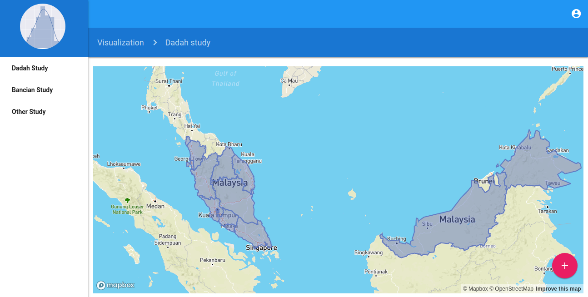
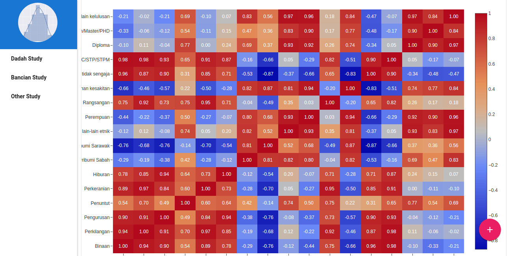
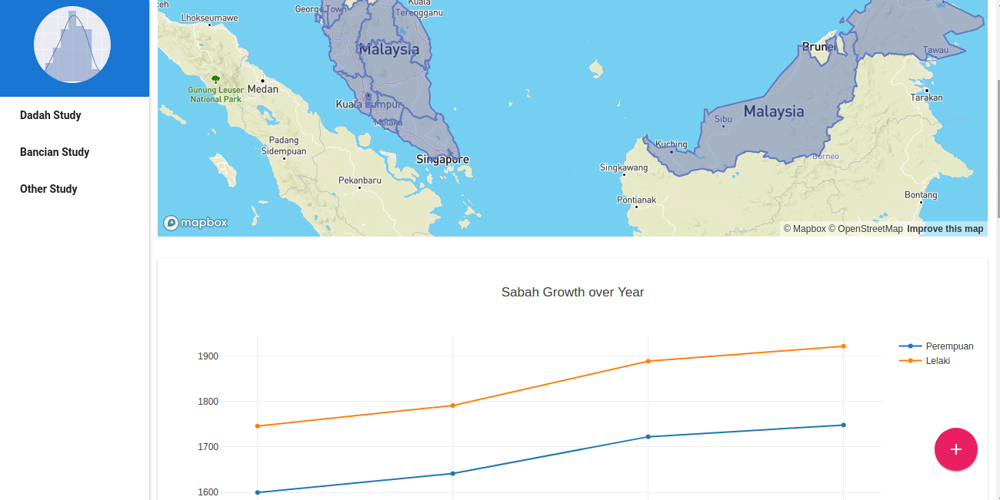
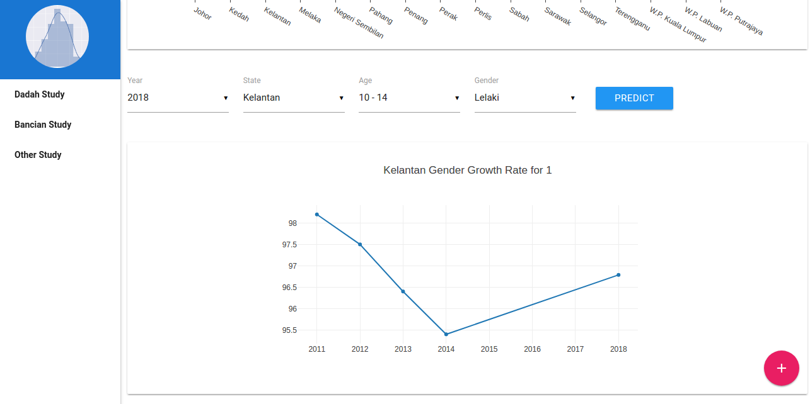
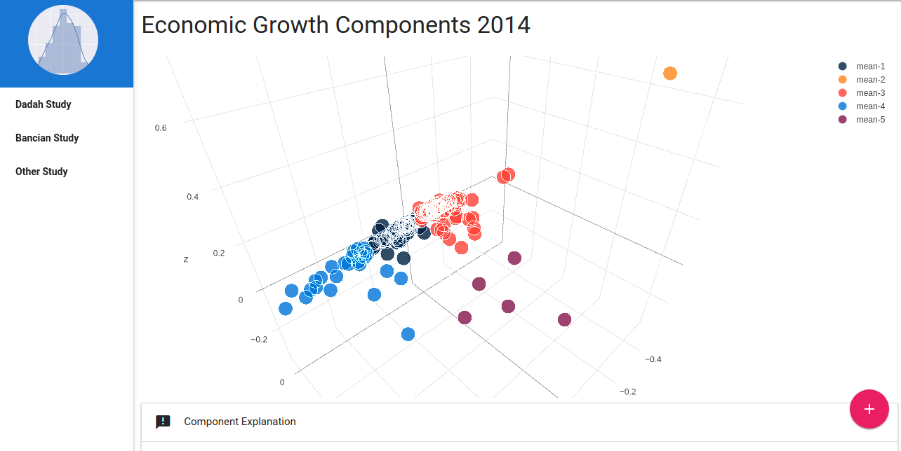
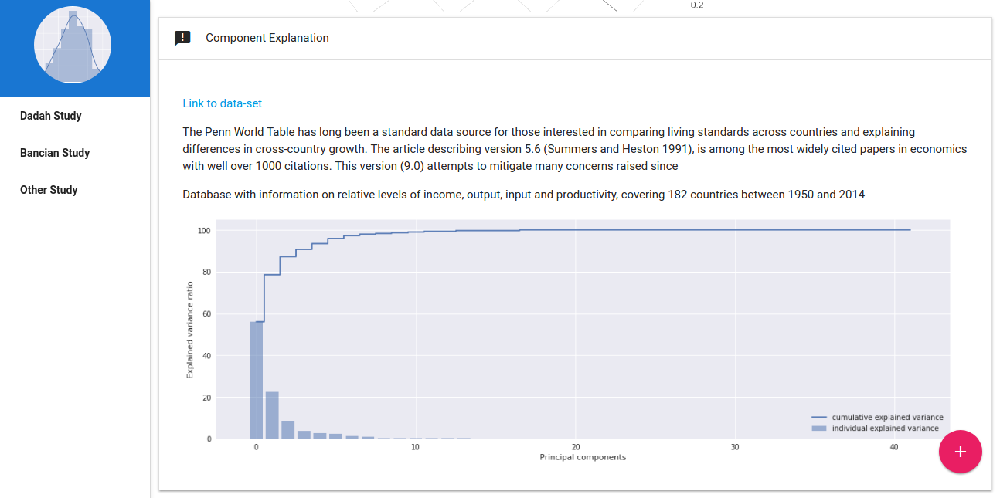

# Mampu, data hackathon 2017

### What included in the system mampu/
1. Correlation study for drugs in Malaysia
2. Bancian study
3. Bancian forecasting
4. 3D visualization for happiness countries
5. 3D visualization for economic growth
6. Use Materialize css framework
7. Plotly libraries
8. Mapbox API
9. Flask API for bancian forecasting using Gradient Tree Boosting

I code it from scratch and able to complete it in 24 hours. You can get the code for the system in mampu/

You can check the system [here](http://www.huseinhouse.com/mampu/)

#### Some output

