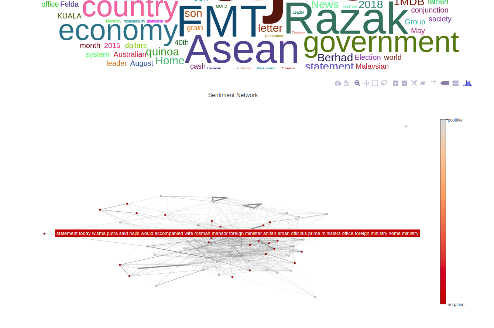
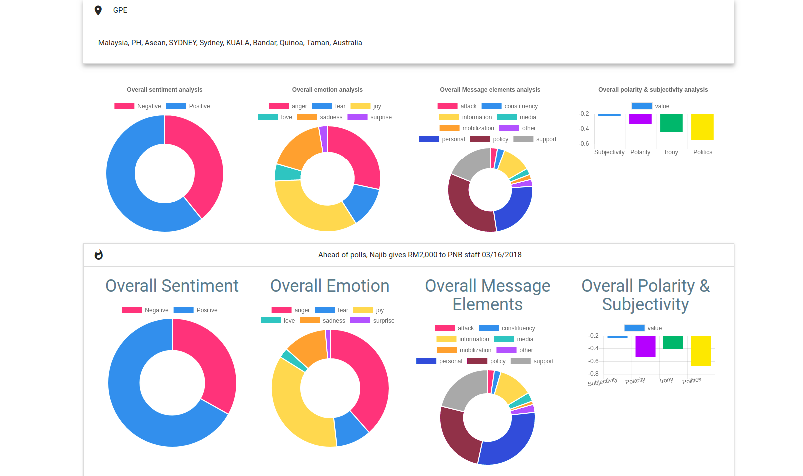

# [News-Analysis](http://www.huseinhouse.com/trendsentiment/)
news analysis system including early-stopping weights

## How-to

0. Download pretrained models from [here](https://drive.google.com/open?id=18BwhY97eratT-J3RVZ85MQeL6Ok0VhgW), unzip in current directory.

1. clone this repository
```bash
git clone https://github.com/Mongoool/News-Analysis.git && cd News-Analysis
```

2. spawn workers
```bash
# worker count
bash gunicorn.sh 1
```

## Results




