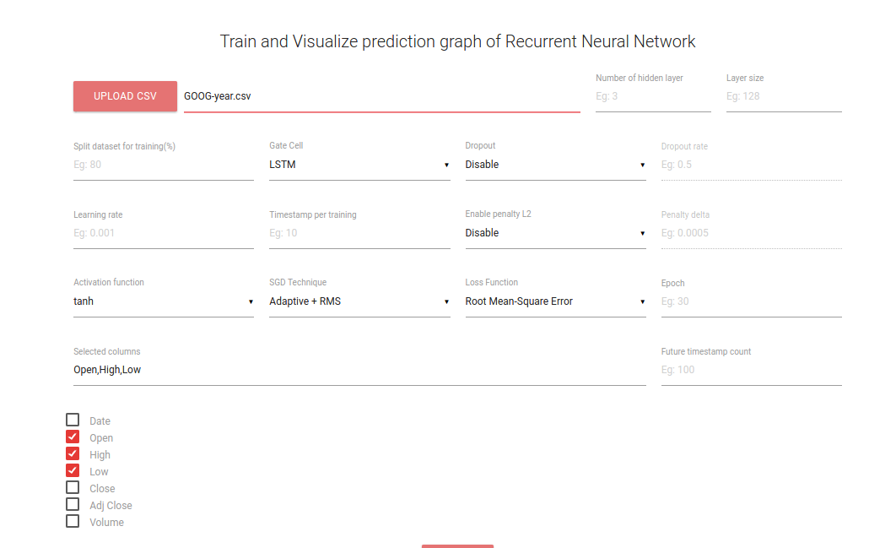
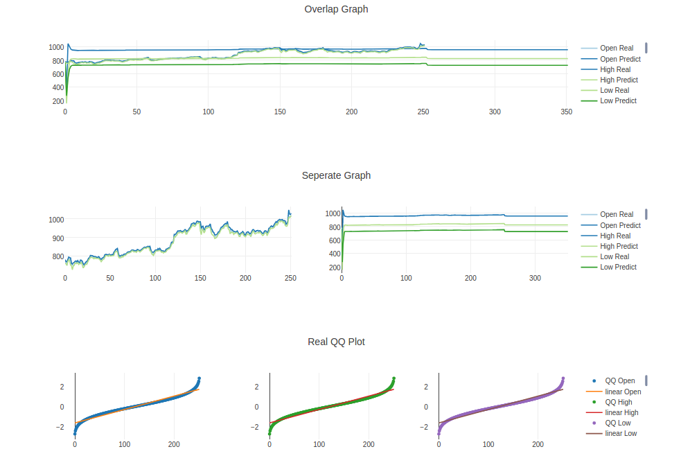

# Recurrent-Network-101
Train your own time-stamp data-set on browser using deep recurrent neural network

## Try it live [HERE](http://www.huseinhouse.com/recurrentnet/)

## Predict your own data-set historical stock / forex / crypto using customized Recurrent Neural Network on the browser!
It supports:
1. upload custom data-set
2. custom number of layer
3. custom layer size
4. custom splitting data-set
5. custom gate cell
6. custom dropout or not
7. custom l2 normalization or not
8. custom learning rate
9. custom stochastic gradient techniques
10. custom cost functions
11. custom timestamp
12. custom epoch
13. custom columns you want to predict
14. custom future timestamp you to predict

It also visualized QQ, KDE and PDF plot for every each epoch. You can see the changing of the epoch!

After it done trained, you can slide historical epoch to check previous patterns.

## Information

Included GIF trained on 1 year GOOGLE stock market.

## Screenshot

