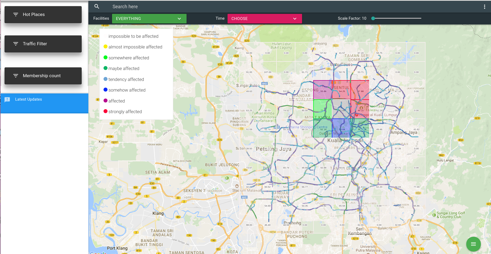
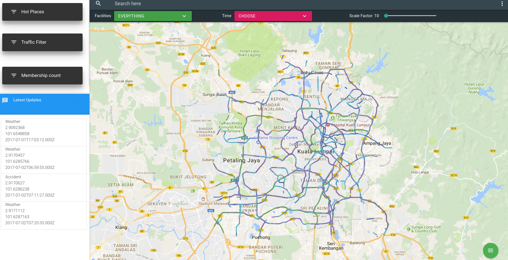
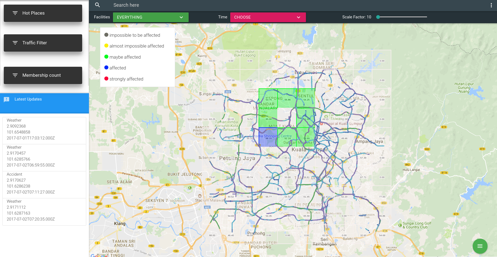
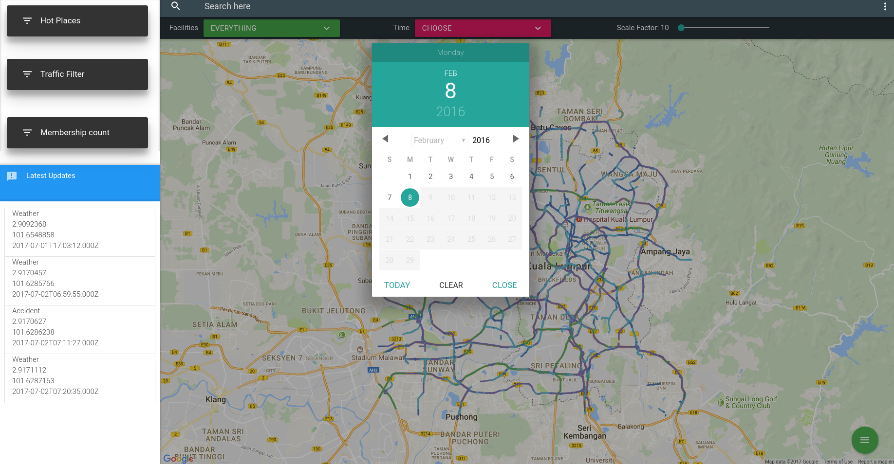
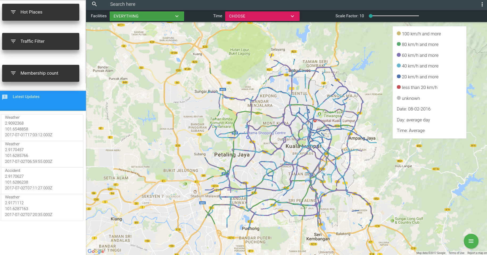
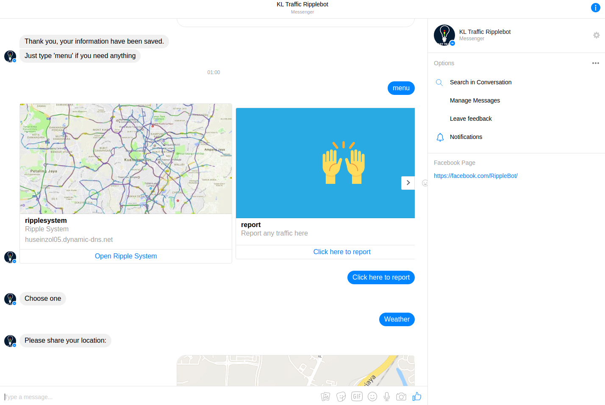
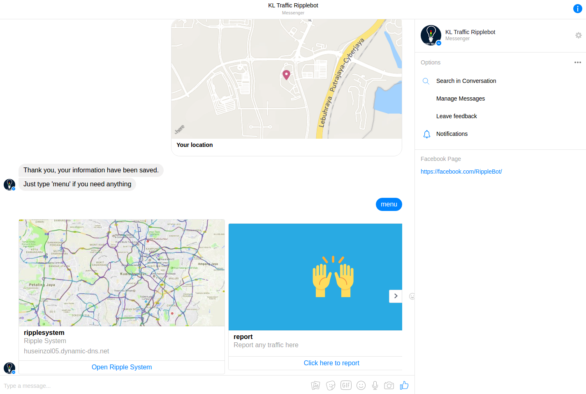

# RippleSystem-Bayesian
Browser system that able to predict affected traffic in Kuala Lumpur using Gaussian distribution on Google Map API.

The traffic data is past data, but it was a real data, you can get from [here, got geojson and csv](https://github.com/DevconX/Traffic-Data/tree/master/ripplesystem), [facilities data, hospitals, schools, malls, government buildings around KL](https://github.com/DevconX/Geolocation-KualaLumpur), thanks to OpenTraffic and Grab for willing to share this opendata.

## You can visit this website [HERE](https://huseinzol05.dynamic-dns.net/ripplesystem)

#### Basically this system:

1- Apply Gaussian distribution to calculate probability density for affected relationship.

2- Apply fuzzy membership from gaussian equation to classify the density classes, heuristically human judges.

3- Use Node JS server for Socket-IO, Webhook for Facebook chatbot integration (code in node-server/, need express libraries, mysql, Socket-IO)

4- Use Flask python web server to visualize traffic correlation with other parameters {humidity, temperature, visibility, dew points, weather} (code in python-server, use pandas, matplotlib, numpy, seaborn)

5- [Facebook chatbot](https://www.messenger.com/t/RippleBot) to push real time data from public user.

6- Heavily used Javascript to developed this system.

If you want to duplicate this engine, you need Node JS, Python flask web server, and SSL certificate for HTTPS, otherwise it doesnt work.

Output
------
## Predict affected traffic with 7 fuzzy membership on gaussian equation

## System screenshot

## Predict affected traffic with 4 fuzzy membership on gaussian equation

## Predict affected traffic with 7 fuzzy membership on gaussian equation

## Visualize correlation data on specific road(you can click any road on the map)

## Change data time

## System screenshot

## Chatbot screenshot

## Chatbot screenshot

