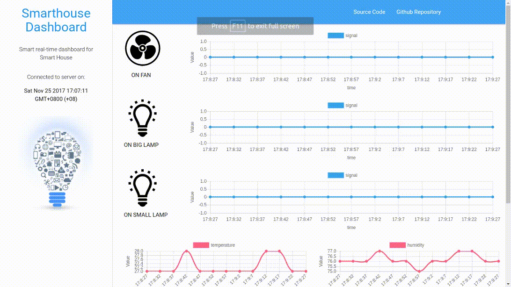

# Smarthouse-Dashboard
Control fan and lights using socket-IO, also visualized real-time humidity and temperature sensors

## My hardwares:
1. 3 Relays mid-voltage
2. 1 temperature and humidity sensor
3. 1 Reka Board
4. 1 Raspberry PI

