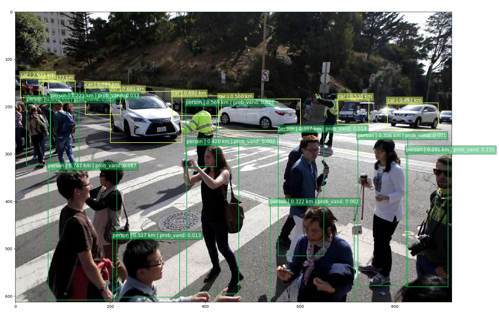
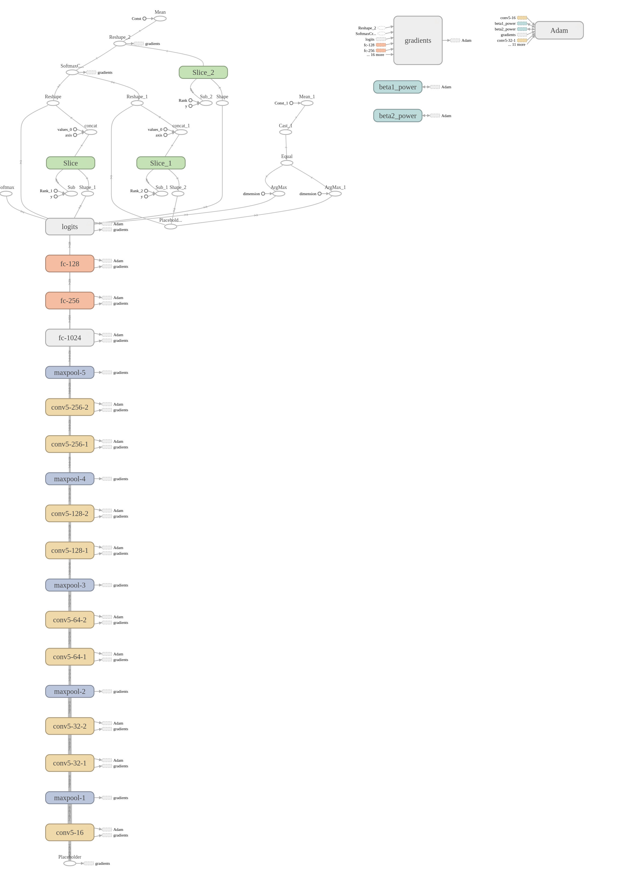

# Vandalism-Detection
Application of SSD Tensorflow to detect probability density for person




Web service


the code for this micro web service is on demos/

we also deploy on live, www.huseinhouse.com/vandalism/

# This model only able to train vandalism applications, cannot improve SSD accuracy.

## Step to train
1. Unzip both positive.zip and negative.zip in current directory. You may delete the pictures inside it and add more
2. run the script
```bash
python train.py
```
but you may check the settings.py first if got memory error on your GPU
```python
picture_dimension = 128
learning_rate = 0.001
batch_size = 32
epoch = 15
```

## Step to test
1. Complete train above or simply download pretrained model from [here](https://drive.google.com/open?id=0BxQQlrLbdunWc1hQODJMazJyaVE), simply unzip in current directory
2. Download SSD pretrained model [here](https://drive.google.com/open?id=0B0qPCUZ-3YwWT1RCLVZNN3RTVEU), create directory called 'checkpoint_ssd' and put in there
3. run the script
```bash
python test_detect.py
```

## Step to deploy own server
1. Complete all above
2. check the code at the bottom of server.py
```python
if __name__ == '__main__':
	app.run(host = '0.0.0.0', threaded = True,  port = 8010)
```
3. If you want to do multi-threading for your server, install gunicorn, and simply,
```bash
sudo pip install gunicorn
sudo gunicorn -w (NUMBER_OF_WORKER) -b (BINDING_ADDRESS:PORT) -p gunicorn.pid (FLASK_PYNAME):app
# sudo gunicorn -w 4 -b 0.0.0.0:8000 -p gunicorn.pid server:app
```

Model for our vandalism detection

