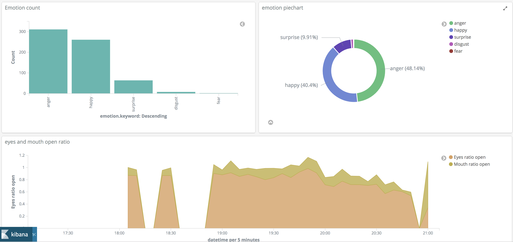
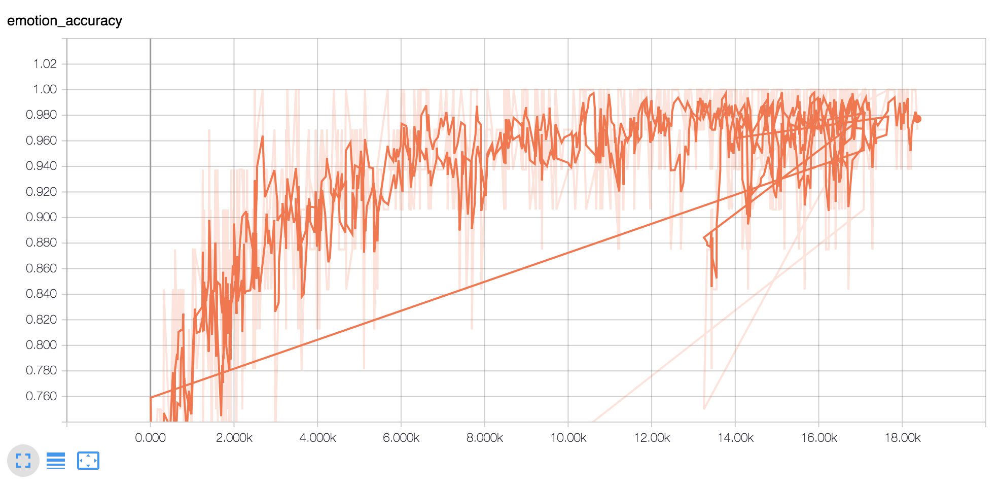
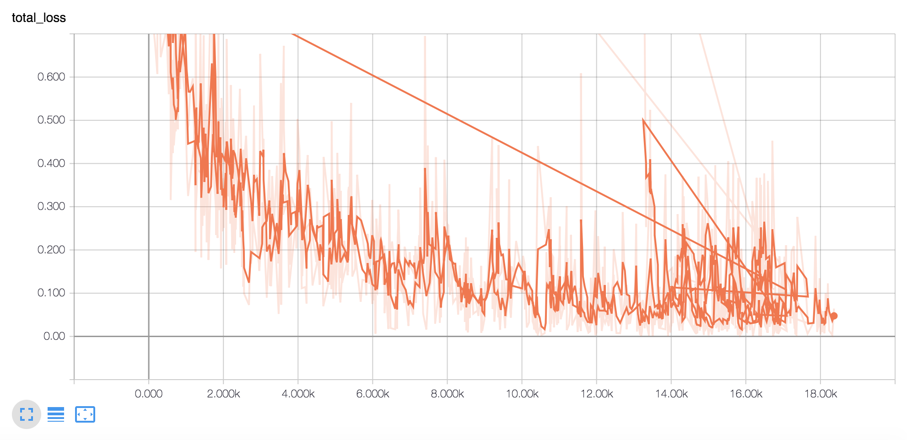
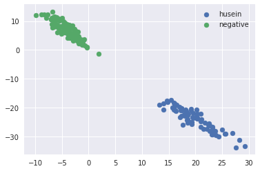
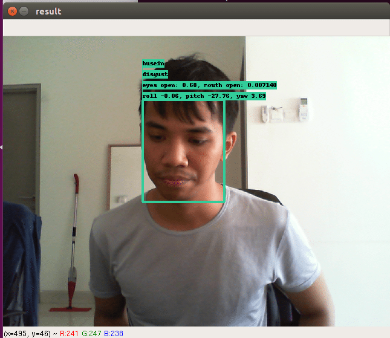

# Face-Analysis-Elastic
Face analysis with deep learning models and elastic search



## How-to-Install

```bash
wget -qO - https://artifacts.elastic.co/GPG-KEY-elasticsearch | apt-key add -
echo "deb https://artifacts.elastic.co/packages/6.x/apt stable main" | tee -a /etc/apt/sources.list.d/elastic-6.x.list
apt-get update && apt-get install elasticsearch
apt-get update && apt-get install kibana
pip3 install scipy tweepy elasticsearch numpy sklearn scikit-learn Flask gunicorn eventlet unidecode flask_cors
cp elasticsearch.yml /etc/elasticsearch/
cp kibana.yml /etc/kibana/
service elasticsearch start
service kibana start
```

## Steps

You can download my pretrained models from [here](https://drive.google.com/file/d/1_GA-d4eYhg7QTdM9_4ovy-k65Sa-ej5v/view?usp=sharing)

#### 1. Download emotion dataset from [here](https://drive.google.com/file/d/1S-OaOoIjyoaw-n8S-nXryibp6wrvsu_o/view?usp=sharing), unzip in the same directory.
#### 2. Download pretrained models from [here](https://drive.google.com/open?id=1P6C28t5L4rXiv7zdBJnAm1iqDipnfYBn), unzip in the same directory.
#### 3. Finetune Mobilenet V2 for our new emotion dataset, [finetune-emotion.ipynb](finetune-emotion.ipynb).

Accuracy graph from Tensorboard


Cross-entropy graph from Tensorboard


#### 4. Capture face to train our face detection.

```bash
python3 save-face.py husein
```

#### 5. Train Mobilenet V2 for face detection using triplet loss, [triplet-loss.ipynb](triplet-loss.ipynb).

2D embedded from [triplet-loss-2d.ipynb](triplet-loss-2d.ipynb)



#### 6. Testing with [live.py](live.py).



#### 7. I found it headless server cannot detect webcam, so I created streaming application using Flask socketio from my camera slave to my server.

edit server-es.py,
```python
socketio.run(app, host = '0.0.0.0', port = 6020,debug=True)
```

edit client.py,
```python
# make sure same port and ip with server-es.py
socketIO = SocketIO('http://192.168.0.1', 6020)
```

## Visit-the-index

You can check the dashboard from [http://huseinhouse.com/elasticsearch/sentiment-dashboard/](http://huseinhouse.com/elasticsearch/sentiment-dashboard/)
