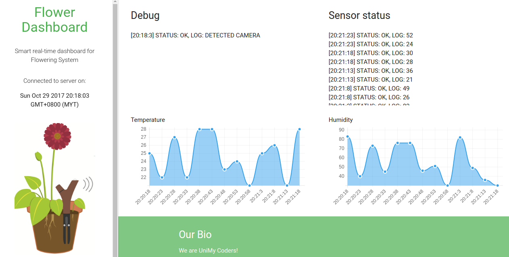

# Flower-Dashboard
Smart Flowering System integrated with sensors and Deep Learning

Back-end language used:
1. Python Flask with Gunicorn
2. Node JS

Sensors used:
1. Temperature sensor
2. Humidity sensor

#### Sensors are pulled from raspberry PI
#### You can this notebook for training session to detect flowers [Notebook link](https://github.com/huseinzol05/Flower-Dashboard/blob/master/train.ipynb)

Live website able to do:
1. Probability study for pollinator attraction
2. Heatmap for flowers position
3. Live update from temperature sensor
4. Live update from humidity sensor

