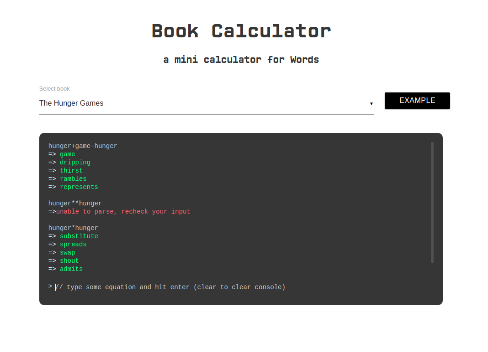

# Word-Calculator
Leisure projects to implement calculator parser on Word Vector

The word vectors trained on famous books I can get on the Internet.
1. Harry Potter and the Philosopher's Stone
2. Harry Potter and the Chamber of Secrets
3. Harry Potter and the Prisoner of Azkaban
4. Harry Potter and the Goblet of Fire
5. Harry Potter and the Half-Blood Prince
6. Harry Potter and the Deathly Hallows
7. The Hunger Games
8. Catching Fire
9. Game of Throne

### Please do not pirate those books like I am, support Original.

### Unzip pretrained models from [here](https://drive.google.com/open?id=1WCvSWmxruV73RRhoTTktk65E4ajaTTsE), and unzip in current directory.

## You can try the calculator [here](http://www.huseinhouse.com/word-calculator/)

